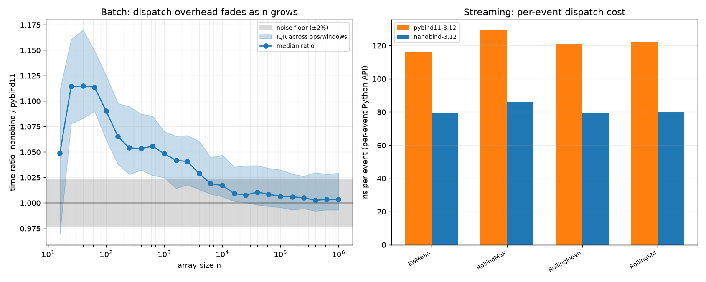

# screamer binding migration: pybind11 vs nanobind performance comparison

Ratio convention throughout: **nanobind_time / pybind11_time**. Below 1.0 means nanobind is faster; ~1.0 means no difference; above 1.0 means nanobind is slower.

## Primary comparison (both on Python 3.12, same machine, back-to-back)

Measurement noise floor (within-config split-half self-ratio): overall typical deviation ±0.5%, 90th-pct ±2.3%. The floor is regime-dependent because small-n absolute times are tiny and noisier: small-n (n<=100) 90th-pct ±6.3%, large-n (n>=1e5) 90th-pct ±1.5%. Judge each regime against its own floor.

### Headline numbers

| metric | ratio (nano/pyb) | reading |
|---|---|---|
| Batch, small n (n<=100) | 1.103 (IQR [1.066, 1.149]) | nanobind slower (small-n noise ±6.3%) |
| Batch, large n (n>=1e5) | 1.004 (IQR [0.993, 1.029]) | no difference (within noise) (large-n noise ±1.5%) |
| Streaming per-event API | 0.666 (IQR [0.657, 0.670]) | nanobind faster |
| Streaming engine (stays in C++) | 1.007 | no difference (within noise) |

Streaming per-event absolute cost (median across ops/windows): pybind11 121.0 ns/event, nanobind 80.3 ns/event.

Batch cells joined: 2215. Repeats per cell: 15 (median used).

### Per-operator ratios (median)

| op | batch small-n | batch large-n | streaming per-event |
|---|---|---|---|
| Abs | 1.207 | 1.062 | - |
| Butter2 | 1.146 | 0.791 | - |
| Clip | 1.165 | 1.063 | - |
| Diff | 1.203 | 1.071 | - |
| Erf | 1.261 | 1.035 | - |
| Erfc | 1.189 | 1.039 | - |
| EwMean | 1.173 | 1.035 | 0.685 |
| EwStd | 1.084 | 1.002 | - |
| EwVar | 1.077 | 1.007 | - |
| EwZscore | 1.095 | 1.003 | - |
| Exp | 1.152 | 1.025 | - |
| Ffill | 1.082 | 1.001 | - |
| FillNa | 1.114 | 1.012 | - |
| Lag | 1.115 | 1.019 | - |
| Log | 1.138 | 1.046 | - |
| LogReturn | 1.073 | 0.980 | - |
| Return | 1.043 | 0.972 | - |
| RollingKurt | 1.040 | 0.981 | - |
| RollingMax | 1.129 | 0.998 | 0.666 |
| RollingMean | 1.125 | 1.004 | 0.657 |
| RollingMedian | 1.054 | 0.998 | - |
| RollingMin | 1.075 | 0.999 | - |
| RollingPoly1 | 1.063 | 0.993 | - |
| RollingQuantile | 1.135 | 1.005 | - |
| RollingRms | 1.081 | 0.994 | - |
| RollingSkew | 0.967 | 0.909 | - |
| RollingStd | 1.073 | 0.999 | 0.659 |
| RollingSum | 1.150 | 0.995 | - |
| RollingVar | 1.077 | 0.997 | - |
| RollingZscore | 1.092 | 1.005 | - |
| Sign | 1.124 | 1.007 | - |
| Sqrt | 1.179 | 1.010 | - |

## Interpretation

- The C++ numeric kernels are byte-identical between the two builds; only the Python binding/dispatch layer changed. So large-n batch parity is the **expected and correct** result: at large n the per-call dispatch cost is amortized over millions of elements and the compute-bound kernel dominates. A large large-n difference would signal a measurement problem, not a real effect.

- Any real difference lives in per-call dispatch overhead, most visible at small n and in the per-event streaming path. Read those rows against the noise floor above before claiming anything.

- Per-op large-n scatter is a few percent in both directions; the pooled large-n median (1.004, and 1.003 at n=1e6) is the reliable figure. The scatter is structured, not uniform noise:

    - Slightly above 1.0 (Diff 1.07, Clip 1.06, Abs 1.06, Log 1.05, Erfc 1.04, Erf 1.04, EwMean 1.03, Exp 1.03, Lag 1.02): the very cheapest kernels (a shift, a subtract, an abs), where nanobind's marginally higher array-marshalling fixed cost is still not fully amortized even at n=1e6 because the kernel does almost no work per element. This is the same array-path effect seen at small n, just faded.

    - Below 1.0 (Butter2 0.79, RollingSkew 0.91, Return 0.97, LogReturn 0.98, RollingKurt 0.98): a binding change cannot speed up an identical C++ inner loop over ~1e6 elements, so these single-op excursions are run-to-run measurement variance (CPU frequency / scheduling during that op's block), not a real effect.

## Mechanism (targeted micro-benchmark, both venvs, same machine)

The batch and streaming results move in opposite directions at small inputs, so a focused micro-benchmark was run to locate the cause. It separates object construction, scalar `op(x)` dispatch, and small-array `op(array)` dispatch. Median ns from 7-9 timeit rounds:

| path | nanobind | pybind11 | ratio nano/pyb |
|---|---|---|---|
| construct `RollingMean(10)` | 679 ns | 848 ns | 0.80 (nanobind faster) |
| scalar call `op(float)` | 68 ns | 112 ns | 0.61 (nanobind ~39% faster) |
| construct + call on array(16) | 1792 ns | 1524 ns | 1.18 (nanobind slower) |
| construct + call on array(100) | 1847 ns | 1589 ns | 1.16 (nanobind slower) |

Reading: nanobind's **scalar / per-event** dispatch is markedly cheaper (68 vs 112 ns), which is exactly the streaming path (`op(v)` per event) and the headline win. Its **numpy-array in/out** marshalling carries a somewhat higher fixed per-call cost, which shows only when that fixed cost is a large fraction of the call, i.e. tiny arrays. Object construction is slightly cheaper under nanobind, so it is not the source of the small-n batch gap. As the array grows the fixed marshalling cost is amortized and the identical kernel dominates, giving the large-n parity above.

## Secondary: confounded comparison vs preserved pybind11-on-3.11 baseline

This compares the new nanobind wheel on Python 3.12 against the old pybind11 wheel measured earlier on Python **3.11**. It reflects the real-world 'old wheel vs new wheel' upgrade experience, but it **confounds the binding change with the 3.11 -> 3.12 interpreter change** and should not be read as a pure binding effect.

| metric | ratio (nano-3.12 / pyb-3.11) |
|---|---|
| Batch small n (n<=100) | 1.066 |
| Batch large n (n>=1e5) | 1.005 |
| Streaming per-event API | 0.709 |
