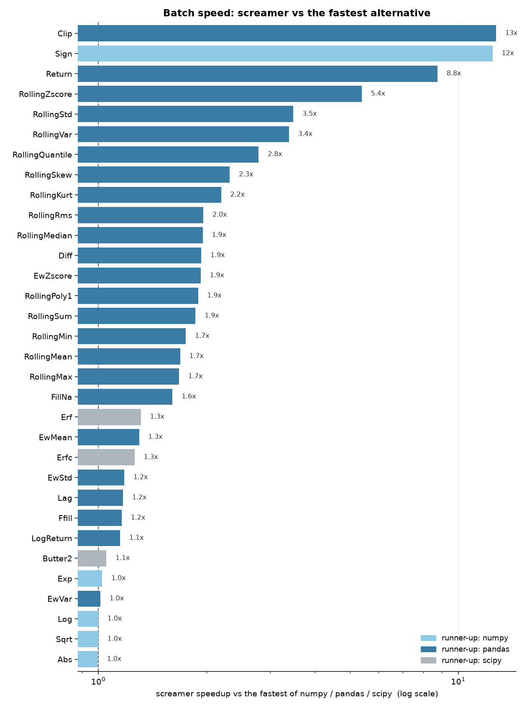

# Performance

screamer runs batch computations as fast as or faster than the equivalent numpy
and pandas code, and many times faster for rolling-window statistics. The reason
is the algorithms, not just the C++: every function updates its result in constant
time per sample and makes a single pass, so a rolling statistic costs the same
whether the window is 10 or 10,000. numpy rebuilds each window, so its cost grows
with the window; pandas carries per-call overhead on top of its own pass.

## Batch speedups

The chart compares screamer against the fastest of numpy, pandas, and scipy on a
one-million-element array. A bar past `1x` means screamer is faster; the colour
marks which library came second.



Every one of the 32 functions is at least as fast as the fastest of numpy,
pandas, and scipy. The rolling statistics run 1.7x to 6x faster than pandas, and
far faster than numpy, whose sliding-window cost grows with the window while
screamer's does not. Full numbers, against numpy and pandas separately:

| function | vs numpy | vs pandas | vs fastest |
|---|---|---|---|
| `Clip` | 1.8x | 13x | **13x** |
| `Sign` | 12x | - | **12x** |
| `Return` | 2.0x | 8.8x | **8.8x** |
| `RollingZscore` | 8.0x | 5.4x | **5.4x** |
| `RollingStd` | 6.2x | 3.5x | **3.5x** |
| `RollingVar` | 6.2x | 3.4x | **3.4x** |
| `RollingQuantile` | 1.8x | 2.8x | **2.8x** |
| `RollingSkew` | 30x | 2.3x | **2.3x** |
| `RollingKurt` | 22x | 2.2x | **2.2x** |
| `RollingRms` | 3.2x | 2.0x | **2.0x** |
| `RollingMedian` | 1.3x | 1.9x | **1.9x** |
| `Diff` | 1.0x | 1.9x | **1.9x** |
| `EwZscore` | - | 1.9x | **1.9x** |
| `RollingPoly1` | 1.9x | 1.9x | **1.9x** |
| `RollingSum` | 1.7x | 1.9x | **1.9x** |
| `RollingMin` | 1.0x | 1.7x | **1.7x** |
| `RollingMean` | 1.7x | 1.7x | **1.7x** |
| `RollingMax` | 0.9x | 1.7x | **1.7x** |
| `FillNa` | 2.5x | 1.6x | **1.6x** |
| `Erf` | - | - | **1.3x** |
| `EwMean` | 1.0x | 1.3x | **1.3x** |
| `Erfc` | - | - | **1.3x** |
| `EwStd` | - | 1.2x | **1.2x** |
| `Lag` | 1.0x | 1.2x | **1.2x** |
| `Ffill` | 5.1x | 1.2x | **1.2x** |
| `LogReturn` | 1.0x | 1.1x | **1.1x** |
| `Butter2` | - | - | **1.1x** |
| `Exp` | 1.0x | - | **1.0x** |
| `EwVar` | - | 1.0x | **1.0x** |
| `Log` | 1.0x | - | **1.0x** |
| `Sqrt` | 1.0x | - | **1.0x** |
| `Abs` | 1.0x | - | **1.0x** |

## Why it is fast

- **Constant work per sample.** A rolling mean keeps a running sum; a rolling
  standard deviation keeps running moments; a rolling maximum keeps a monotonic
  deque. Each new sample updates that state in O(1), so a full pass is O(n) for
  any window size.
- **One pass, no window rebuild.** The numpy sliding-window approach scans every
  window, which is O(n * window). screamer never looks back over the window.
- **C++ with thin bindings.** The compute runs in C++, the same code the batch,
  streaming, and pipeline paths all share, so there is no per-element Python.

The same speed applies live: because a value computed on a stream is the same
code as the batch pass, the streaming path processes each event in O(1) too.

## Reproduce it

The suite lives in `benchmarks/`. Regenerate the numbers and this chart on your
own hardware with:

```
make benchmark
```

It times a screamer variant of each function against numpy, pandas, and scipy
references across a range of array and window sizes, writes per-function CSVs to
`benchmarks/experiments/`, and rebuilds the plots. The numbers above are from a
single machine, so treat them as ratios rather than absolutes; the shape holds
across hardware.
