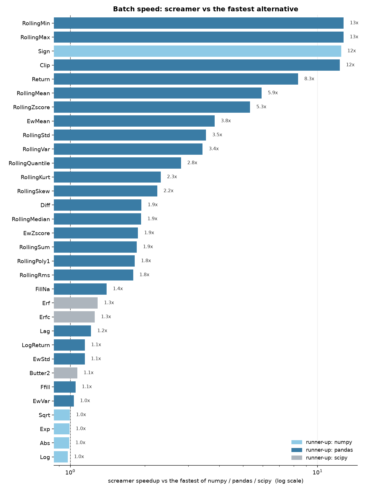

# Performance

There are two questions, and they have different answers. Over a whole array,
screamer is as fast as or faster than the equivalent numpy and pandas code, and
many times faster for rolling-window statistics. Over a live stream, where a
value is needed before the next event arrives, the gap is much wider, because a
batch library has no way to update a result: it recomputes the trailing window
every event.

In both regimes the reason is the algorithms, not just the C++. Most functions
update their result in constant time per sample and make a single pass, so their
cost does not grow with the window. The rank-based statistics (the rolling
median, quantiles, IQR, and CVaR) keep a sorted structure and update in
O(log window). numpy rebuilds each window, so its cost grows linearly with the
window; pandas carries per-call overhead on top of its own pass.

## Batch speedups

The chart compares screamer against the fastest of numpy, pandas, and scipy on a
one-million-element array. A bar past `1x` means screamer is faster; the colour
marks which library came second.



Every one of the 32 functions is at least as fast as the fastest of numpy,
pandas, and scipy. The rolling statistics run 1.7x to 6x faster than pandas, and
far faster than numpy, whose sliding-window cost grows with the window while
screamer's does not. Full numbers, against numpy and pandas separately:

| function | vs numpy | vs pandas | vs fastest |
|---|---|---|---|
| `Clip` | 1.8x | 13x | **13x** |
| `Sign` | 12x | - | **12x** |
| `Return` | 2.0x | 8.8x | **8.8x** |
| `RollingZscore` | 8.0x | 5.4x | **5.4x** |
| `RollingStd` | 6.2x | 3.5x | **3.5x** |
| `RollingVar` | 6.2x | 3.4x | **3.4x** |
| `RollingQuantile` | 1.8x | 2.8x | **2.8x** |
| `RollingSkew` | 30x | 2.3x | **2.3x** |
| `RollingKurt` | 22x | 2.2x | **2.2x** |
| `RollingRms` | 3.2x | 2.0x | **2.0x** |
| `RollingMedian` | 1.3x | 1.9x | **1.9x** |
| `Diff` | 1.0x | 1.9x | **1.9x** |
| `EwZscore` | - | 1.9x | **1.9x** |
| `RollingPoly1` | 1.9x | 1.9x | **1.9x** |
| `RollingSum` | 1.7x | 1.9x | **1.9x** |
| `RollingMin` | 1.0x | 1.7x | **1.7x** |
| `RollingMean` | 1.7x | 1.7x | **1.7x** |
| `RollingMax` | 0.9x | 1.7x | **1.7x** |
| `FillNa` | 2.5x | 1.6x | **1.6x** |
| `Erf` | - | - | **1.3x** |
| `EwMean` | 1.0x | 1.3x | **1.3x** |
| `Erfc` | - | - | **1.3x** |
| `EwStd` | - | 1.2x | **1.2x** |
| `Lag` | 1.0x | 1.2x | **1.2x** |
| `Ffill` | 5.1x | 1.2x | **1.2x** |
| `LogReturn` | 1.0x | 1.1x | **1.1x** |
| `Butter2` | - | - | **1.1x** |
| `Exp` | 1.0x | - | **1.0x** |
| `EwVar` | - | 1.0x | **1.0x** |
| `Log` | 1.0x | - | **1.0x** |
| `Sqrt` | 1.0x | - | **1.0x** |
| `Abs` | 1.0x | - | **1.0x** |

## Streaming

Batch numbers describe one regime. The other is a feed: an event arrives and the
current value of the statistic is needed before the next one does.

screamer updates its state and returns the new value, which is O(1) or
O(log window) per event. numpy, pandas and TA-Lib have no incremental entry
point, so the only way to get the current value is to hand them the trailing
window again. That is O(window) per event however fast the library is.

Cost per event, on a stream of 200,000 samples of `RollingMean`:

| window | screamer | TA-Lib | numpy | pandas |
|---|---|---|---|---|
| 10 | **90 ns** | 547 ns | 1482 ns | 11491 ns |
| 100 | **92 ns** | 619 ns | 1521 ns | 11709 ns |
| 1000 | **93 ns** | 1324 ns | 1687 ns | 12954 ns |

screamer is 6x to 14x faster than TA-Lib here, 16x to 18x faster than numpy, and
about 130x faster than pandas. It is also the only one whose cost does not grow
with the window: at a window of 5000, TA-Lib reaches 4491 ns per event while
screamer is unchanged.

The loop in that table is compiled, so the interpreter is not part of the
measurement. Compiling the event loop is worth having, and it helps every
library: screamer goes from about 115 ns per event under a plain Python loop to
about 90. It does not change the ordering, because what separates the libraries
is whether they can update a result rather than recompute one.

### Let screamer own the loop

Nearly all of those 90 nanoseconds are the call into the extension rather than
the operator. Every library pays that on every event, and for all of them it is
the dominant cost.

The way past it is to stop calling per event and let the loop run inside
screamer, which is what the array call and [`Pipeline`](pipelines.md) do. The
same recurrence, over the same stream, then costs **about 1 ns per event**,
roughly a hundred times less:

```python
# 90 ns per event: the loop is yours, and every event crosses into the extension
op = screamer.RollingMean(100)
for value in feed:
    current = op(value)

# ~1 ns per event: the loop is screamer's, and events stay in C++
current = screamer.RollingMean(100)(values)
```

A `Pipeline` does the same for a graph of operators over a live feed, so the
per-event boundary is crossed once for the whole graph rather than once per
operator. There is no equivalent for a batch library: TA-Lib has no streaming
entry point to build such a loop around.

## Why it is fast

- **Constant or logarithmic work per sample.** A rolling mean keeps a running sum,
  a rolling standard deviation keeps running moments, and a rolling maximum keeps a
  monotonic deque; each new sample updates that state in O(1). The rank-based
  statistics (rolling median, quantiles, IQR, CVaR) keep a balanced search tree and
  update in O(log window). Neither rebuilds the window, so a full pass is O(n) or
  O(n log window), against numpy's O(n * window).
- **One pass, no window rebuild.** The numpy sliding-window approach scans every
  window, which is O(n * window). screamer never looks back over the window.
- **C++ with thin bindings.** The compute runs in C++, the same code the batch,
  streaming, and pipeline paths all share, so there is no per-element Python.

The same cost applies live: a value computed on a stream runs the same code as the
batch pass, so the streaming path does the same per-event work, O(1) or
O(log window).

## Reproduce it

The suite lives in `benchmarks/`. Regenerate the numbers and this chart on your
own hardware with:

```
make benchmark
```

It times a screamer variant of each function against numpy, pandas, scipy and
TA-Lib references across a range of array and window sizes, writes per-function
CSVs to `benchmarks/experiments/`, and rebuilds the plots.

The streaming numbers come from a second suite:

```
make benchmark-streaming
```

It measures cost per event against window size, and gives each reference library
the strongest form available rather than a naive one: a preallocated ring buffer
of the trailing window, no allocation per event, and the fastest reduction the
library offers. It reports the same operator under a plain Python loop, under a
compiled loop, and through screamer's own array path, so the cost of the
per-event boundary is visible rather than folded into the result. The compiled
loops need Cython; without it those rows are skipped and the rest still runs.

The numbers on this page are from a single machine, so treat them as ratios
rather than absolutes; the shape holds across hardware.
